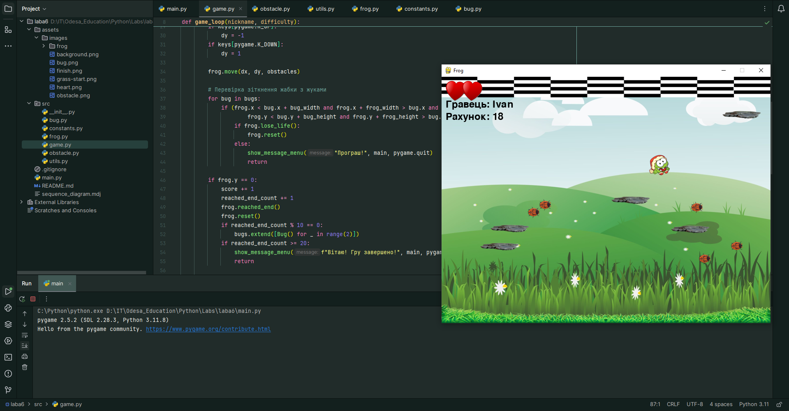

# Лабораторна робота 6. Створення ігрової програми засобами бібліотеки Pygame

На цій лабораторній роботі було створено гру Жабка. Програма має простий функціонал. Мета гри: дійти жабці 20 раз до фінішу. Жабка стартує з початкового місця, на дорозі до фінішу перед нею з’являються перешкоди, та жуки. Жабка має 3 спроби зіткнення з жуками. Кожні 3 рівні, жабка отримує нові скіни.

Результати тестування програми:

